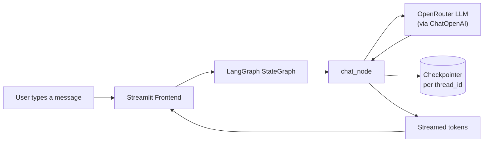

<div align="center">

# Chatbot_V2

### A stateful, streaming AI chat app powered by LangGraph, Streamlit & OpenRouter

*Multi-conversation memory. Real-time token streaming. Zero-cost LLM inference.*

[](https://www.python.org/)
[](https://streamlit.io/)
[](https://www.langchain.com/)
[](https://langchain-ai.github.io/langgraph/)
[](https://openrouter.ai/)


</div>

---

## Overview

**Chatbot_V2** is a conversational AI application that goes beyond a single-turn chat wrapper. It models the conversation as a **compiled state graph** (via LangGraph) rather than a linear script, giving it a clean, extensible foundation for adding memory, tools, and multi-step reasoning down the line.

The app supports **multiple independent conversation threads**, each with its own checkpointed message history, a **live token-streaming UI**, and runs entirely on **free-tier LLM inference** through OpenRouter — no paid API key required to get started.

---

## Key Features

| | |
|---|---|
| **Graph-based conversation engine** | Built with LangGraph's `StateGraph`, defining the chat flow as `START → chat_node → END` — a foundation that's easy to extend with tools, branching, or RAG nodes. |
| **Multi-thread chat sessions** | Every conversation gets a unique `uuid4` thread ID. Users can start new chats, switch between past ones from the sidebar, and pick up right where they left off. |
| **Stateful persistence via checkpointing** | LangGraph's checkpointer captures each thread's full message history, so conversation state survives across turns and thread switches. |
| **Real-time streaming responses** | Assistant replies are streamed token-by-token into the UI using `chatbot.stream(..., stream_mode="messages")` paired with Streamlit's `write_stream`. |
| **Auto-generated chat titles** | The sidebar automatically names each conversation from its first user message — no manual labeling needed. |
| **Zero-cost LLM inference** | Uses an OpenAI-compatible `ChatOpenAI` client pointed at OpenRouter's free auto-routed model (`openrouter/free`), so the app runs without a paid model subscription. |
| **Clean separation of concerns** | `backend.py` owns the graph/LLM logic; `frontend.py` owns the UI — decoupled and independently testable. |
| **Custom-styled chat UI** | Hand-tuned CSS for distinct user/assistant message bubbles instead of default Streamlit styling. |

---

## How It Works



1. The user sends a message in the Streamlit UI.
2. The message is added to that thread's state (`messages`) and passed into the compiled LangGraph graph.
3. The `chat_node` invokes the LLM (routed through OpenRouter) with the full message history.
4. The checkpointer persists the updated state against the active `thread_id`, so switching chats reloads the correct history.
5. The response is streamed back to the UI as it's generated, rather than waiting for the full reply.

---

## Tech Stack

| Layer | Technology |
|---|---|
| **Frontend / UI** | Streamlit |
| **Orchestration** | LangGraph (`StateGraph`, checkpointing) |
| **LLM Integration** | LangChain + `langchain-openai` |
| **Model Provider** | OpenRouter (free-tier auto-routed model) |
| **State Management** | Per-thread UUIDs + LangGraph checkpointer |
| **Language** | Python 3.10+ |

---

## Getting Started

```bash
# 1. Clone the repo
git clone https://github.com/nihal00753/Chatbot_V2.git
cd Chatbot_V2

# 2. Create a virtual environment
python -m venv venv
source venv/bin/activate   # Windows: venv\Scripts\activate

# 3. Install dependencies
pip install -r requirements.txt

# 4. Add your OpenRouter API key
echo "OPENROUTER_API_KEY=your_key_here" > .env

# 5. Run the app
streamlit run frontend.py
```

Get a free OpenRouter API key at [openrouter.ai](https://openrouter.ai/).

---

## Project Structure

```
Chatbot_V2/
├── backend.py         # LangGraph state graph, LLM client, checkpointing
├── frontend.py         # Streamlit UI, session state, sidebar, streaming
├── requirements.txt     # Python dependencies
└── .gitignore
```

---

## What This Project Demonstrates

- Designing LLM applications as **graphs**, not just linear prompt chains — a pattern that scales cleanly to tool-calling, RAG, and multi-agent workflows.
- Managing **multi-session conversational state** with checkpointing, rather than relying on a single in-memory list.
- Building a **reactive, streaming UI** on top of a backend generator/stream interface.
- Integrating a third-party, OpenAI-compatible **LLM gateway** (OpenRouter) instead of hardcoding a single vendor's SDK.

---

## Roadmap

- [ ] Move from in-memory checkpointing to durable **SQLite/Postgres** persistence across restarts
- [ ] Add tool-calling / RAG nodes to the graph
- [ ] User authentication for multi-user deployments
- [ ] Deploy to Streamlit Community Cloud / Docker

---

## Connect

Built by [**@nihal00753**](https://github.com/nihal00753) — feel free to open an issue or connect on GitHub.
